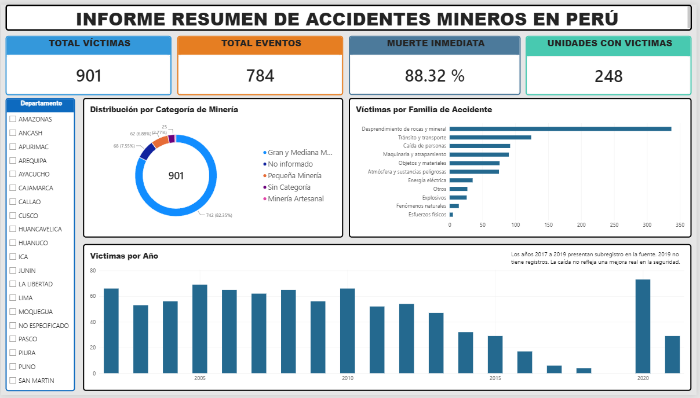
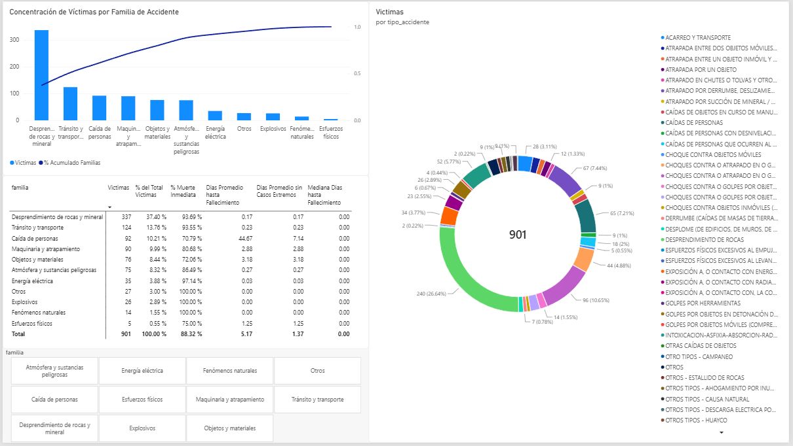
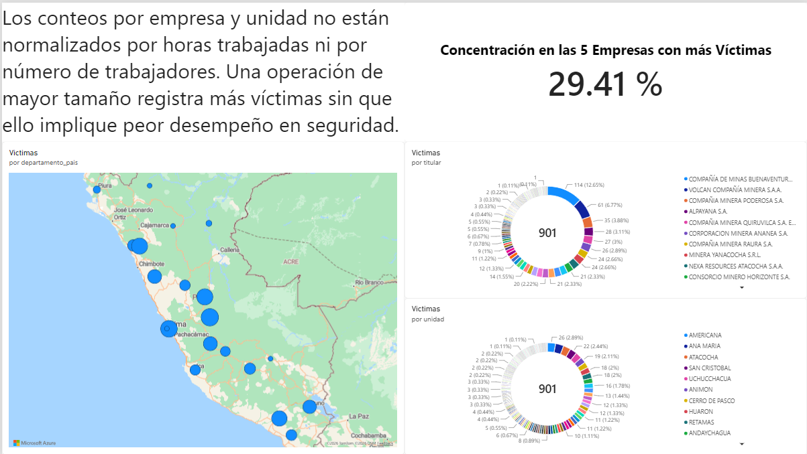
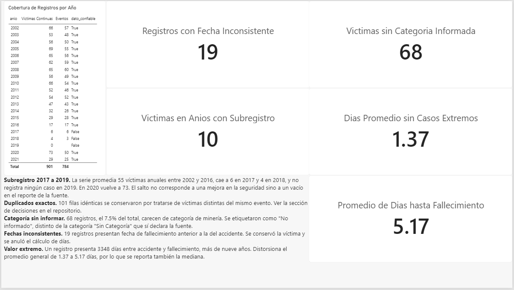

# Seguridad Minera Perú

Análisis de los accidentes mortales registrados en la minería peruana entre 2002 y 2021, desde el dato crudo publicado por el MINEM hasta un tablero de Business Intelligence.

## Contexto

El Ministerio de Energía y Minas publica el registro de accidentes mortales ocurridos en unidades mineras del país. Este proyecto toma ese archivo, lo procesa y lo lleva a un modelo analítico para responder tres preguntas:

- ¿Cómo ha evolucionado la cantidad de accidentes mortales a lo largo de veinte años?
- ¿Qué tipos de accidente concentran la mayor cantidad de víctimas?
- ¿Cómo se distribuyen geográficamente y en qué medida se concentran en pocas unidades mineras?

## Fuente de datos

| Campo | Detalle |
|---|---|
| Dataset | Accidentes Mortales en Mina |
| Entidad | Ministerio de Energía y Minas (MINEM) |
| Portal | Plataforma Nacional de Datos Abiertos del Perú |
| Formato original | CSV, separador `;`, codificación ISO-8859-1 |
| Volumen | 901 registros, 9 columnas |
| Interpretación | 901 víctimas distribuidas en 784 eventos |
| Periodo | 2002 – 2021 |
| Fecha de descarga | 13/09/2026 |
| Condiciones de uso | Datos abiertos de libre uso, citando la fuente |

## Arquitectura

    CSV (MINEM)  ->  Python / pandas  ->  PostgreSQL  ->  Power BI
     extracción      limpieza y ETL     modelo estrella   tablero

| Etapa | Herramienta | Salida |
|---|---|---|
| Extracción | pandas | DataFrame crudo |
| Limpieza y transformación | pandas | `data/processed/accidentes_limpio.csv` |
| Modelado | PostgreSQL 16 | Modelo estrella: 4 dimensiones y 1 tabla de hechos |
| Visualización | Power BI | Tablero de 4 páginas, 15 medidas DAX |

## Estructura del repositorio

    data/raw/         Archivo original del MINEM, sin modificar
    data/processed/   Salidas del pipeline (no versionadas)
    notebooks/        Exploración de datos
    src/              Scripts del pipeline
    sql/              Esquema y consultas de validación
    powerbi/          Archivo .pbix
    docs/             Capturas del tablero y PDF exportado

## Cómo reproducirlo

Requiere Python 3.13, PostgreSQL 16 y Power BI Desktop.

    python -m venv .venv
    .venv\Scripts\activate
    pip install -r requirements.txt

Copiar `.env.example` como `.env` y completar las credenciales locales. Luego:

    psql -U postgres -c "CREATE DATABASE seguridad_minera;"
    psql -U postgres -d seguridad_minera -f sql/01_schema.sql
    cd src
    python limpieza.py
    python carga.py
    cd ..
    psql -U postgres -d seguridad_minera -f sql/02_validacion.sql

Las consultas de validación deben arrojar 901 víctimas, 784 eventos, 11 familias, 7305 días en la tabla de fechas y cero registros huérfanos en las tres llaves foráneas.

## Decisiones de tratamiento del dato

### Duplicados exactos: se conservan

El dataset contiene 101 filas idénticas en sus nueve columnas. Se decidió conservarlas, tratando cada fila como una víctima, por dos razones.

La primera es la distribución de los tipos de accidente. Entre las filas duplicadas están sobre-representados justamente los siniestros de víctimas múltiples, con frecuencias de dos a cuatro veces superiores a las del conjunto completo:

| Tipo de accidente | En duplicados | En el total |
|---|---:|---:|
| Ahogamiento por inundación | 4.1% | 1.0% |
| Atrapada entre dos objetos móviles | 4.7% | 1.6% |
| Golpes por detonación de explosivos | 7.1% | 2.9% |
| Atrapado por derrumbe o deslizamiento | 15.3% | 7.4% |
| Intoxicación, asfixia, absorción | 11.2% | 5.8% |
| Desprendimiento de rocas | 22.9% | 26.6% |

El desprendimiento de rocas, que por su naturaleza suele cobrar una sola vida, es el único sub-representado. Si los duplicados fueran errores de carga, su distribución sería equivalente a la del conjunto.

La segunda razón es que existen eventos con varias filas y distinta fecha de fallecimiento, lo que indica que el registro es por persona y no por evento.

En consecuencia se incorpora el campo `ID_EVENTO`, construido a partir de la combinación de titular, unidad, ubicación, tipo de accidente, categoría y fecha del accidente. Esto permite reportar ambas magnitudes por separado: víctimas y eventos.

La alternativa descartada, eliminar los duplicados, queda documentada como línea comentada en el script de limpieza.

### Valores nulos

`CATEGORIA` presenta 68 nulos, equivalentes al 7.5% del total. Se asignan a la etiqueta "No informado", deliberadamente distinta de "Sin Categoría", que es una clasificación que la propia fuente declara para otros 25 registros. Confundir ambas habría fusionado un dato faltante con un dato declarado.

Las columnas de ubicación presentan 2 nulos correspondientes a los mismos dos registros, etiquetados como "NO ESPECIFICADO". Se conservan en los totales y se excluyen únicamente del mapa.

### Agrupación de tipos de accidente

Los 39 valores originales de `TIPO_ACCIDENTE` se agrupan en 11 familias según el agente que produce la lesión. El mapeo vive en `src/mapeo_familias.py`, separado del script de limpieza, para que pueda auditarse sin leer el pipeline.

| Familia | Víctimas |
|---|---:|
| Desprendimiento de rocas y mineral | 337 |
| Tránsito y transporte | 124 |
| Caída de personas | 92 |
| Maquinaria y atrapamiento | 90 |
| Objetos y materiales | 76 |
| Atmósfera y sustancias peligrosas | 75 |
| Energía eléctrica | 35 |
| Otros | 27 |
| Explosivos | 26 |
| Fenómenos naturales | 14 |
| Esfuerzos físicos | 5 |

Tres casos requirieron criterio:

- `EXPOSICIÓN A, O CONTACTO CON RADIACIONES` se unifica con `INTOXICACION-ASFIXIA-ABSORCION-RADIACIONES`, ya que el segundo tipo comprende explícitamente las radiaciones y el dataset no ofrece ningún elemento que permita distinguirlos.
- `OTROS TIPOS - DESCARGA ELECTRICA POR RAYO` se clasifica como fenómeno natural y no como energía eléctrica, porque su control corresponde a protocolos de tormenta y no a procedimientos sobre instalaciones eléctricas.
- `OTROS TIPOS - CAUSA NATURAL` se asigna a Otros, dado que en registros de seguridad minera designa fallecimientos por causa médica y no eventos de la naturaleza.

La fuente presenta además dos inconsistencias de escritura: `EXPOSICIÓN A, O CONTACTO CON, LA CORRIENTE ELÉCTRICA`, con un único caso, es el mismo tipo que `EXPOSICIÓN A, O CONTACTO CON ENERGÍA ELÉCTRICA`, y `OTRO TIPOS - CAMPANEO` omite la letra ese del prefijo. Ambos se mapean a la familia que les corresponde.

### Fechas de fallecimiento anteriores al accidente

19 registros, el 2.1% del total, presentan una fecha de fallecimiento anterior a la del accidente. Se conserva la fila, porque corresponde a una víctima real, se deja nulo el campo `DIAS_HASTA_FALLECIMIENTO` y se marca con la bandera `FECHA_INCONSISTENTE`. El cálculo de días se realiza en consecuencia sobre 882 casos.

### Valor extremo en el tiempo hasta el fallecimiento

Un registro presenta 3348 días entre el accidente y el fallecimiento, más de nueve años. Por sí solo eleva el promedio general de 1.37 a 5.17 días, y el de la familia Caída de personas de 7.14 a 44.67.

No se elimina, porque no existe evidencia concluyente de que sea un error de captura. En su lugar se reportan tres métricas en paralelo: promedio, promedio excluyendo casos superiores a un año, y mediana. La mediana resulta ser cero en todas las familias.

## Modelo de datos

| Tabla | Filas | Contenido |
|---|---:|---|
| `dim_empresa` | 154 | Titulares mineros |
| `dim_unidad` | 248 | Unidades con su ubicación política |
| `dim_tipo` | 39 | Tipos de accidente y su familia |
| `dim_tiempo` | 7305 | Un día por cada fecha entre 2002 y 2021 |
| `fact_accidente` | 901 | Una fila por víctima |

`dim_tiempo` se genera con `generate_series` en el propio DDL, de modo que cubre el periodo completo sin huecos aunque no haya accidentes en esas fechas. Una tabla de fechas incompleta invalida los cálculos de inteligencia temporal en el tablero.

La clave de `dim_unidad` es la combinación de unidad y ubicación, no el nombre de la unidad. El dataset contiene dos unidades distintas llamadas SAN CRISTOBAL, una en Yauli (Junín) y otra en Cayllona (Arequipa): usar el nombre como clave las habría fusionado en un solo registro y distorsionado los conteos por unidad.

El esquema está en `sql/01_schema.sql`, escrito a mano con llaves primarias, llaves foráneas y tipos explícitos. La carga se ejecuta con `src/carga.py`, que lee las credenciales desde `.env` y es idempotente: trunca las tablas antes de insertar.

Las consultas de `sql/02_validacion.sql` comparan los totales cargados contra el CSV limpio y verifican que no existan registros huérfanos en ninguna de las tres llaves foráneas.

## El tablero

Cuatro páginas construidas sobre 15 medidas DAX. El archivo está en `powerbi/seguridad_minera.pbix` y la exportación completa en `docs/seguridad_minera.pdf`.

### Tipos de accidente

Diagrama de Pareto por familia y una matriz que cruza frecuencia con letalidad: porcentaje de muerte inmediata, promedio de días hasta el fallecimiento, promedio sin casos extremos y mediana.

### Geografía

Distribución por departamento, titular y unidad minera, con la advertencia expresa de que los conteos no están normalizados por exposición.

### Calidad del dato

Cobertura de registros año por año, incidencias detectadas y el efecto del valor extremo sobre el promedio. La tabla de cobertura muestra 2019 con cero registros, que es el modo más claro de exhibir el vacío de la fuente.

## Hallazgos

**El 88% de las víctimas fallece el mismo día del accidente.** De los 882 registros con diferencia de fechas válida, 779 presentan cero días entre el accidente y el fallecimiento. La mediana es cero en las once familias sin excepción. En minería subterránea el margen de rescate es prácticamente inexistente.

**El desprendimiento de rocas y mineral concentra el 37% de las víctimas.** 337 de 901, casi tres veces más que la segunda familia. Sumado a tránsito y transporte, y a caída de personas, las tres primeras familias explican más del 60% del total.

**Los siniestros de víctimas múltiples son minoría pero pesan.** Las 901 víctimas se distribuyen en 784 eventos. 74 eventos concentraron más de una víctima y explican 191 fallecimientos, el 21% del total.

**La concentración empresarial es moderada.** Las cinco empresas con más víctimas acumulan el 29.4% de los registros, en un universo de 154 titulares y 248 unidades mineras.

**El periodo 2017 a 2019 presenta un subregistro evidente.** La serie promedia 55 víctimas anuales entre 2002 y 2016, cae a 6 en 2017 y 4 en 2018, y no registra ningún caso en 2019. En 2020 vuelve a 73. La magnitud del salto descarta una mejora real en la seguridad y apunta a un vacío en el reporte de la fuente.

## Limitaciones conocidas

- El dataset no distingue entre trabajadores de empresas contratistas y de titulares mineros, por lo que no es posible analizar esa diferencia.
- No existe un denominador de exposición, como horas trabajadas o número de trabajadores, por lo que no se pueden construir tasas de accidentabilidad comparables entre empresas. Cualquier conteo absoluto favorece a las operaciones de mayor tamaño, y así se advierte en la página de Geografía del tablero.
- El periodo 2017 a 2019 presenta un subregistro que impide interpretar la serie temporal completa como una medición homogénea.
- 19 registros presentan fechas inconsistentes que quedan excluidos del cálculo de días transcurridos.
- El dataset no incluye identificador de persona, por lo que la distinción entre víctimas y eventos se infiere a partir de la combinación de campos descrita en la sección de decisiones.

## Autor

Gabriel Enrique Melchor Enciso
Estudiante de Ingeniería de Sistemas de Información, Universidad Peruana de Ciencias Aplicadas
